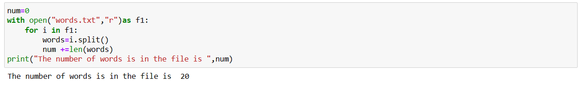

# Word-count
## AIM:
To write a python program for getting the word count from a text.
## EQUIPEMENT'S REQUIRED: 
PC
Anaconda - Python 3.7
## ALGORITHM: 
### Step 1:
Open visual studio code.
### Step 2: 
 Create file with py.extension.
### Step 3: 
Start the program.
### Step 4:  
Write the code.
### Step 5: 
Run terminal for output of the given program.
### Step 6: 
End the program.
## PROGRAM:
 ```
 #Developed by: VARSHINI D
 #Register number: 212223230234

 num=0
 with open("words.txt","r")as f1:
 for i in f1:
 words=i.split()
 num +=len(words)
 print("The number of words is in the file is ",num)
 ```

### OUTPUT:

## RESULT:
Thus the program is written to find the word count from a text.
